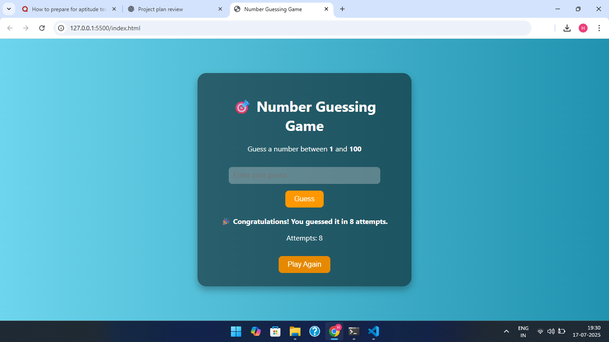

# 🎯 Number Guessing Game

## 📝 Project Description

This is a simple and fun Number Guessing Game built using **HTML, CSS, and JavaScript**. The computer randomly selects a number between 1 and 100, and the player tries to guess it. After each guess, the game gives feedback whether the guessed number is too high, too low, or correct.

---

## 🎯 Goal of the Project

- To understand and practice **JavaScript loops**, especially `while` and `if-else` logic.
- To learn how to **generate random numbers** using `Math.random()`.
- To strengthen **DOM manipulation skills** with `querySelector`, `addEventListener`, and element styling.
- To get hands-on with **user interaction**, such as form input, validation, and dynamic feedback.
- To structure and style a basic web game using **CSS**.
  
---

## 🛠️ Features

- Random number generation between 1 to 100.
- Input box for player guesses.
- Feedback for each guess (Too high / Too low / Correct).
- Guess history tracking.
- Game reset button.
- Styled with responsive and clean CSS.
- Image added to enhance visual appeal.

---

## 📷 Screenshot

 

---

Enjoy the game and keep learning!

